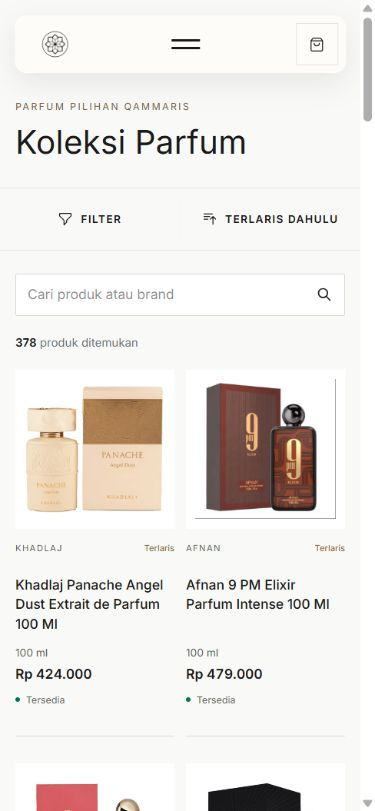

# Approved audit release — 2026-10-07

AUD-01–07 are reviewed, released and complete within their approved scopes. This release does **not** close the separate [P9 acceptance limits](../p9-01/README.md) or start AUD-08.

## Authorization and delivery

Owner's continuation approval authorized review/consolidation, staging/MySQL migration and production release. A separate explicit reply authorized a temporary staging actor inside a transaction followed by full rollback. No existing account/credential/permission, other site, source application, DNS or billing change.

The final stack PR [24](https://github.com/husen211/Qammaris-Parfum-Website/pull/24) was retargeted to main and its description rewritten around the complete release. It includes all commits from PR16–23; PR16 was automatically marked merged, superseded intermediate PR17–23 closed without deleting branches. No repeated intermediate deployments. The already-applied Supremacy correction was documented, not rerun.

- Reviewed application head: `f7509e4897b9dcd7ce36a8444459410a5620be40`.
- Safe manual candidate build [37598933131](https://github.com/husen211/Qammaris-Parfum-Website/actions/runs/37598933131): succeeded; manual dispatch only built, did not deploy.
- Candidate archive SHA-256: `a4bb96c5424025ae26861d19fce45e8af5a490db549437ad797963777e1b2da5`; local and staging copies matched.
- Main merge `9325df4444e71f1bce996120af85b76af7ebba29`, 09:28:15 UTC / 16:28:15 Asia/Bangkok.
- Main [CI37600831489](https://github.com/husen211/Qammaris-Parfum-Website/actions/runs/37600831489): **382 PHP tests / 2,666 assertions; 31 JavaScript tests; Node/Vite build passed**.
- Automatic [production release37600911352](https://github.com/husen211/Qammaris-Parfum-Website/actions/runs/37600911352): build/deploy succeeded. Server revision/current link and deployment log independently confirmed `9325df4` at 09:30:18 UTC.
- Queue restarted through the normal release script. Observed one PHP worker with cwd at this exact release; cron scheduler/watchdog heartbeats at 09:32:01 UTC.

GitHub remains the source/asset delivery path. Shared DB/env/uploaded storage are outside releases/Git. File Manager, secrets and workflow/security gates were unchanged.

## MySQL rehearsal and production impact

Staging and production connection fingerprints proved separate databases. Both initially had zero pending migrations. Candidates were prepared in private sibling `audit-candidates/<review SHA>` paths with existing protected env links, isolated logs/framework cache and persistent public-media links; public staging routing was not replaced. Existing permissions were not changed.

Only `2026_10_07_000001_create_product_admin_changes_table.php` ran. No blind all-migrations command, down/drop/reseed, backfill or data rounding. The existing deployment pending-migration refusal remains intact.

- Staging first DDL succeeded; the initial editor probe then stopped because no staging admin existed. No product write occurred in that failed probe. After Owner approved a transaction-only actor, selected migration replay, editor history insertion/attribution and unchanged-save no-op passed. All temporary product/account/history writes were rolled back; the table remained empty and user IDs unchanged. Auto-increment gaps from rolled-back test inserts are possible; no ID was reassigned. This CLI operation test is not a staging browser login/HTTP-edit test.
- Production DDL took **75 ms**, replay did nothing and the table was initially empty. Nine pre-existing product/offer/image/taxonomy/provider/source/checkpoint table fingerprints and user IDs matched before/after. No production admin fixture/edit or forced feed sync was performed. [Exact safe migration metadata](production-mysql.json), [staging rehearsal](staging-mysql.json).
- Existing product IDs, variant IDs, slugs, photos, prices, availability, publication and provider links were preserved by the migration. Normal public detail reads can increment `view_count`; normal upstream/Owner changes continue independently. Migration fingerprints are a bounded before/after proof, not an indefinite data-freeze claim.
- Actual server: PHP8.2.33, MySQL-compatible MariaDB11.8.9. Concurrent DDL/row-lock load and long-term audit growth/backup retention are **Not confirmed** by this small rehearsal.

Private candidate artifacts are retained outside public routing for reviewed diagnosis; there is no automatic cleanup/destructive retention job. Local operational helper scripts/archive are Git-ignored and contain no copied env/secret values. The synthetic actor password was generated in server memory only and rolled back.

## Post-release checks

[Safe runtime record](production-runtime.json), observed shortly after activation:

| Check | Result |
|---|---|
| Server revision | exact main merge `9325df4` |
| Products / public / image records | 453 / 378 / 1,131 |
| Feed | no key401; key200; checkpoint491, next_seq491, has_more=false |
| Credentials | key/secret filled; values never emitted |
| Snapshots / queue / failed jobs | 459 / 0 / 0; no sync error |
| Pending migrations | none |
| Unsigned webhook | 401 |
| Public HTTP | up, catalog, detail, search, cart, login200 |
| Access protection | unauthenticated admin302; .env403 |
| Product example | Panache Angel Dust898,100ml,Rp424.000,Tersedia; primary file exists |

This checks authenticated feed and live runtime without resetting checkpoints or inventing new employee stock events. Source status/price changes may occur normally after these observations; counts/cursors are dated evidence.

## Browser evidence

Real Chrome production: catalog before/after **390×844 and1440×900**, product detail and four related cards. No horizontal overflow at those viewports; no broken visible images in the observed catalog/detail areas. Native image-link navigation and Kembali succeeded. Whole prices rendered without decimal suffix. Captured warnings came from the browser extension; no application console error was captured. Viewport override was reset and the created inspection tab closed. Resizing/mouse interaction is **not** Safari/touch verification. No new UI redesign was performed during release; detailed earlier UI tests remain in AUD-03/04/06 evidence.

Desktop [before](before-catalog-1440.jpg) / [after](after-catalog-1440.jpg); mobile [before](before-catalog-390.jpg); [detail mobile](after-detail-390.jpg); [shared related cards desktop](after-related-1440.jpg).

## Recovery and next item

Retained previous active code is `0dc6924479ae108177c467a380b3978b1f89c70b`. A separately authorized code-only switch can restore it while retaining the additive audit table, current DB/media/env. Do not run migration down/refresh/reset: that would erase history. Prefer a narrow forward fix for audit failures; writes intentionally fail rather than silently omit history. No rollback was needed or executed.

Recommended next is a bounded **P9 acceptance** task: genuine iPhone/touch, native upload, controlled production source-event timing/replay/outage, populated recipient checkout/WA handoff and Owner disposition of protected media/remaining limits. None was silently waived or started by this release. No payment gateway, machine-write API, cloud migration or additional refactor was begun.
