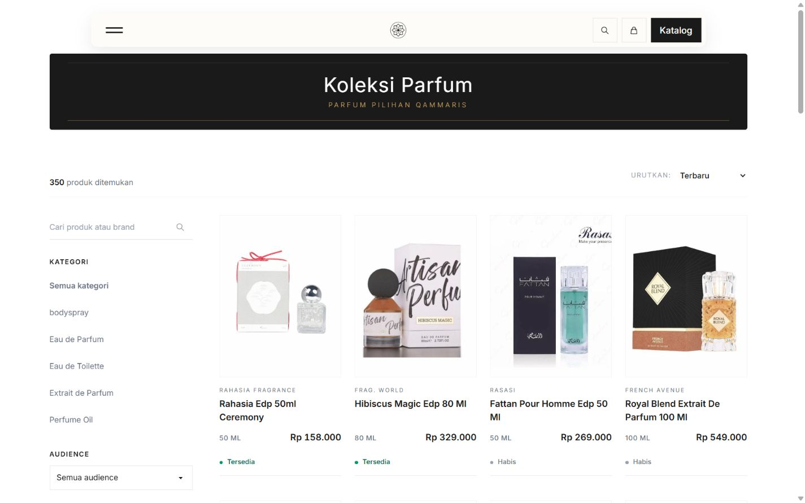
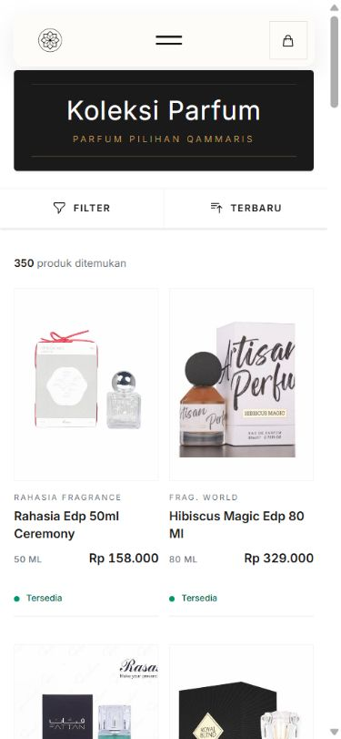
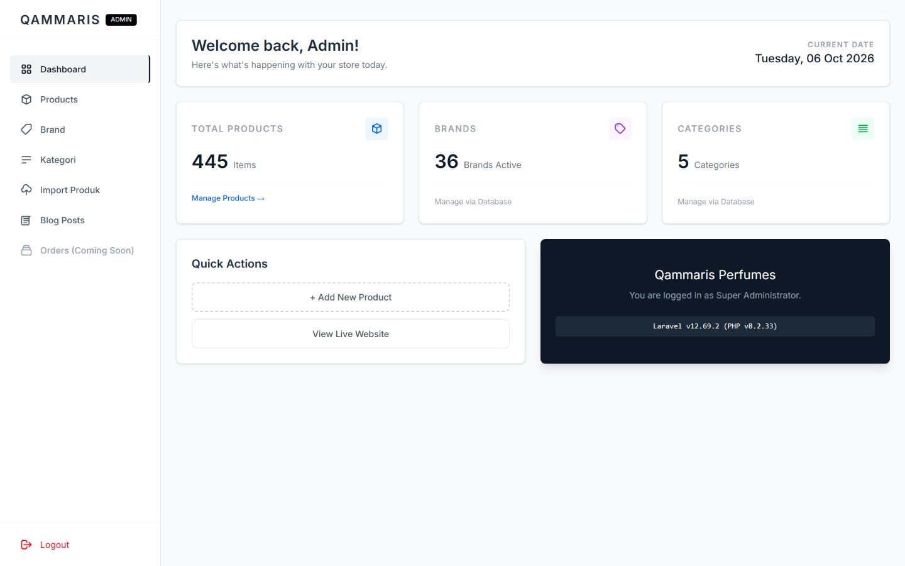
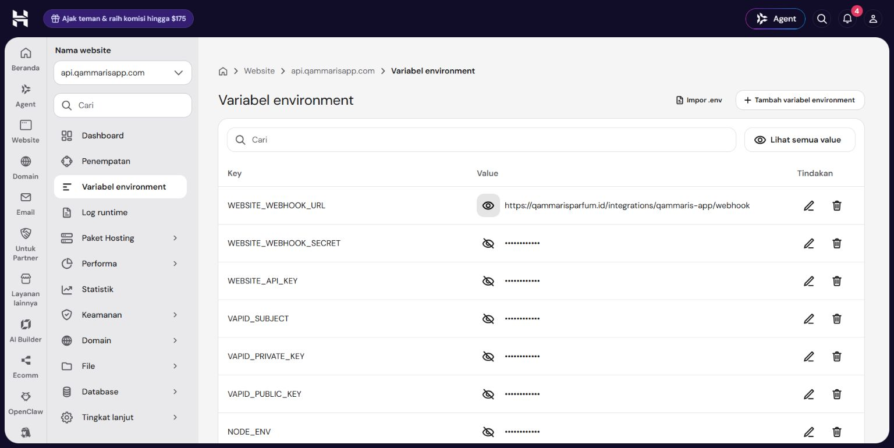

# Production cutover — 2026-10-06

**Website live; GitHub auto-deployment and production webhook configuration verified.** P1-04 is IN_REVIEW for Owner acceptance. No next backlog item started. This record supersedes earlier pending-activation statements in the preparation log.

Owner's “lanjutttttt” continues the concrete reviewed activation scope: only newly prepared target static permissions/public routing, main promotion and auto-deployment, and Node backend WEBSITE_WEBHOOK_URL. No legacy database dump, deletion, permission change, DNS, app frontend, app database or unrelated env change.

## Deployment and recovery

- PR2 merged to main at 07:45:49 UTC / 14:45:49 Asia/Bangkok: `87959623d03c33b99c400e242cb35856b7f1e7a9`.
- Main [CI37431709979](https://github.com/husen211/Qammaris-Parfum-Website/actions/runs/37431709979) passed; [production release37431774330](https://github.com/husen211/Qammaris-Parfum-Website/actions/runs/37431774330) build and deploy both succeeded automatically. Server current/release-revision.txt confirms that exact main SHA. The production environment remains main-only; activation marker present and PRODUCTION_DEPLOY_ENABLED=true.
- Domain public_html now links current/public. Old public_html retained as `public_html_legacy_20261006`; old laravel_app/database untouched. No backup made, following Owner waiver. Only new public files/photos receive0644/directories0755 and their target ancestors0711; protected env and cached config remain0600, private runtime untouched.
- GitHub owns source/dependency/build deployments; DB, protected env and uploaded media remain outside Git in persistent shared paths. File Manager is not part of recurring code deployment.
- Initial activation shell returned a stray carriage-return error after its success message; all guarded HTTP/hash checks, routing swap and activation marker had already completed. Independent actual HTTPS/current/runtime checks confirmed successful activation. No rollback or repeated cutover was performed.
- Code-only rollback: switch current to retained prior release after confirming compatibility; shared data/media/env remain. Full old-site fallback: disable new deployment gate, move new public symlink aside, restore retained legacy folder to public_html and restore backend's previous staging destination if approved. Do not run migration down/delete data. Any future schema change needs its own reviewed deployment.

## Actual production checks

| Check | Result |
| --- | --- |
| Public HTTPS | up/catalog/detail/search/login/home/blog/location/about200; draft404; unauthenticated admin302 |
| Sensitive/private paths | .env403; vendor/autoload.php404; private owner-review path301 then404; AOERA staging fixture404 |
| Catalog/data |350 public +95 draft,445 total; no new catalog mutations this cutover; fixture excluded |
| Photos |1,016 persisted files; public CSS200, actual public JPEG SHA equals approved disk file; visible catalog photos loaded in Chrome |
| App feed |401 without key,200 with key;452 snapshots/checkpoint457/has_morefalse; example BSP Kuta7am100ml available |
| Receiver transport | unsigned401; signed HTTPS202; duplicate wake-up202; valid older revision/change_seq pair202 |
| No-op | after worker drain checkpoint457 remains, queue0/failed0/last_errornull; no source stock, price or publication mutation |
| Payload validation | deliberately mismatched revision/change_seq422; corrected older matching pair202, as contracted |
| Runtime | one actual PHP qammaris-app worker; no schedule:work; two minute cron heartbeats07:51:01UTC; everyThirtyMinutes reconciliation in routes/console.php |
| Admin | real HTTPS login succeeded as new admin@qammaris.com; dashboard445/36brands/5categories, product list445 |
| Chrome | desktop1440x900/mobile390x844 catalog photos and availability visible, no horizontal overflow; native search BSP Kuta returns2; detail shows description/50ml/price/Tersedia and inquiry links |

The browser automation's DOM click did not submit navigation on this session; native browser click did submit search and produced2results. No application defect or code fix is inferred from the automation discrepancy. No captured browser console errors. No new application code, schema, package or UI redesign in this cutover; CI ran the actual full PHP/frontend checks. Bootstrap6tests/37assertions passed during target preparation, not rerun/claimed here.

## Internal backend destination

Only WEBSITE_WEBHOOK_URL changed to `https://qammarisparfum.id/integrations/qammaris-app/webhook`. hPanel applied that one env change and restarted backend api.qammarisapp.com from previous source; deployment `01a1102f-8403-735c-8d4e-37cc7883dee2` completed, root backend/Express/Node22, same source commit921569b4. API key/webhook secret unchanged, masked on screenshot, never emitted. No frontend redeployment or application database operation.

**Not confirmed:** latency of a new actual employee stock event through the application's outbound production webhook. No such source event was generated during cutover. Production signed transport/queue/feed passed; earlier Owner's actual staging sold-out/revert passed around10/13seconds. Those staging timings are not production timings. Actual new-target half-hour scheduler execution after cutover is not separately timed here; minute cron runs and its30-minute definition are confirmed. These are explicit observation limits, not a claim of exhaustive100% scenario verification.

All95 drafts still intentionally await photos/descriptions; optional fragrance-note enrichment and legacy URL recovery are not launch gates under Owner instructions. Next recommended work after acceptance: review/upload media for retained drafts through admin, without automatic publication. No next work started.

## Browser evidence

Additional screenshots: production-detail-mobile-20261006.png, production-search-20261006.png, production-admin-products-20261006.png. Machine-readable safe metadata: production-live-checks-20261006.json. Passwords/API/SSH values are absent.
