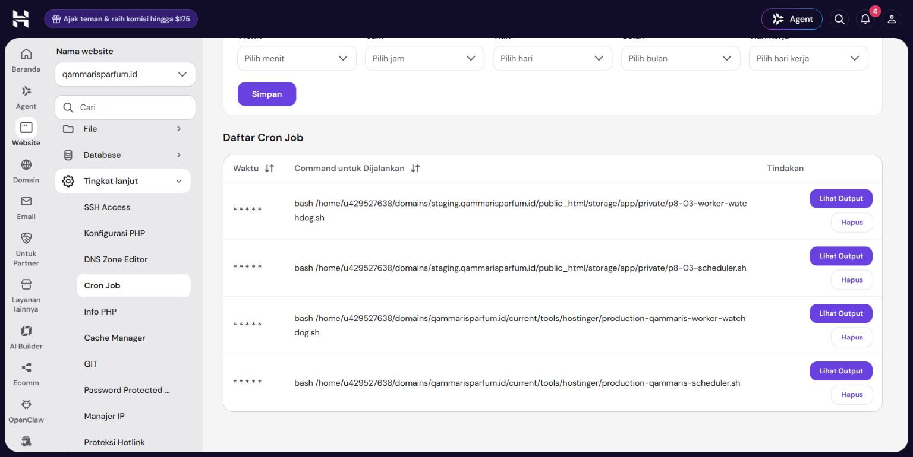

# Production target preparation — 2026-10-06

Status: target prepared; **public cutover and production webhook destination pending Owner approval**. Continue P1-04 only.

## Actual evidence

| Check | Result |
| --- | --- |
| New database | `u429527638_qam_launch`; Owner-created, connection verified empty before22-table existing migration install; MariaDB11.8.9 |
| Protected env | Fresh APP_KEY, production/debugfalse/HTTPS sessions; same staging API pair, values never output; DB password handed off in memory with Owner permission |
| GitHub source | `3538c725709db366f2c2fe835388b825bd2a4403`; CI37428915083 PHP/frontend both successful; release37428910406 successful |
| Package/install | Official GitHub artifact digest plus inner release SHA verified before separate release installation; no env/database/media/runtime/accounts in artifact |
| Catalog | Audited preview1:445valid; transactional MariaDB rehearsal reverted all business rows; final350public+95draft,390offers,795identities including445app UUIDs,36brands/5categories |
| Replay | Exact six-business-table digest unchanged; no duplicate products/mappings/images |
| Photos | 1,016 website files, exact reviewed checksum/size/MIME; fixture excluded;95drafts still no photos/descriptions |
| Owner admin | admin@qammaris.com created, roleadmin/hash verified; plaintext only in session memory for explicitly permitted Owner delivery, never in source/evidence |
| Live feed |401without/200with key; initial checkpoint0 ->457,452snapshots,has_morefalse,errornull;350public(242available/108soldout),95draft,0mappedhidden |
| Target route rendering | Web-context kernel: catalog/detail/search/login/up200,draft404,unauthenticatedadmin302; unsignedwebhook401,signedwebhook202 |
| Worker | One actual PHP qammaris-app/database process;0schedule:work,queued0,failed0; signed duplicate wakeups drained without checkpoint/source changes |
| Cron | Two distinct minute production entries alongside untouched two staging entries; both target heartbeats07:28:02UTC |
| GitHub access | Owner explicitly approved production SSH Secrets after initial auto-review rejection; five secrets present,main-only environment;deployenablefalse |
| Current routing | Internal current link points verified newrelease;public_html_next prepared outside served root;legacy public_html/database untouched |

The first CLI-context rendering check returned500 because AppServiceProvider intentionally skips footer data in console mode. Repeating in web context returned200 without an application change. These kernel checks are not browser/HTTPS production checks. Inbound requests from the internal application still go to staging; no production source-event latency proof is claimed.

Chrome hPanel proof (1536x770 browser surface): two production cron entries saved, two staging entries unchanged. This is an operational screenshot, not a catalog UI verification. Historical staging catalog screenshots remain separate.

## Remaining concrete activation

Owner must approve serving current/public at the main domain, ordinary static-file traversal/read on only newly created target directories (protected env/private data remain private), merging release PR2 into main, enabling the gated deployment workflow, and changing only WEBSITE_WEBHOOK_URL on the internal Node backend to the production receiver. No frontend/database/DNS/other-site changes. New shared/runtime directories currently retain the private creation modes; production web-server static traversal is not yet proved.

Cutover routing: retain old public_html under a separately named legacy directory, then rename the prepared next link into public_html. If HTTPS/catalog/media/login checks fail, restore old routing; keep both databases and new photos/audit evidence. No backup or deletion of waived legacy data. Backend destination change follows receiver/worker readiness. First activation marker and GitHub enable flag must not be created before approval.

Local checks actually run: six bootstrap tests/37assertions passed; PHP lint, scoped Pint, whitespace, Python packager syntax and bash syntax passed. GitHub full PHP tests/frontend builds passed for both7632361and3538c72. No new dependencies/schema changes/UI implementation. Bootstrap operation and pipeline docs are committed; snapshot/media packets remain ignored private operational inputs. Full public-production browser/auth/HTTPS/media and outbound app webhook verification remain after approved cutover.
