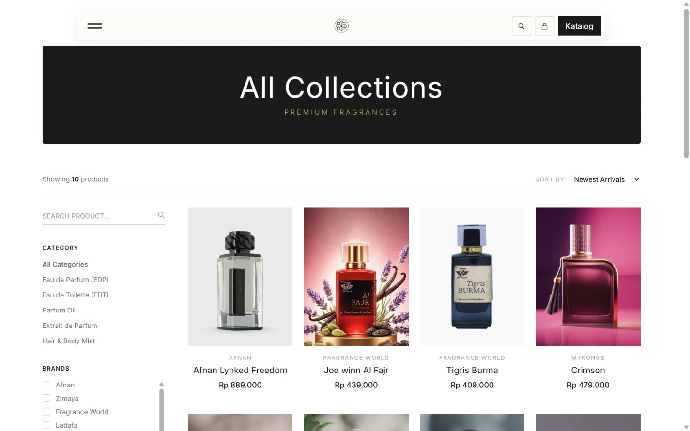
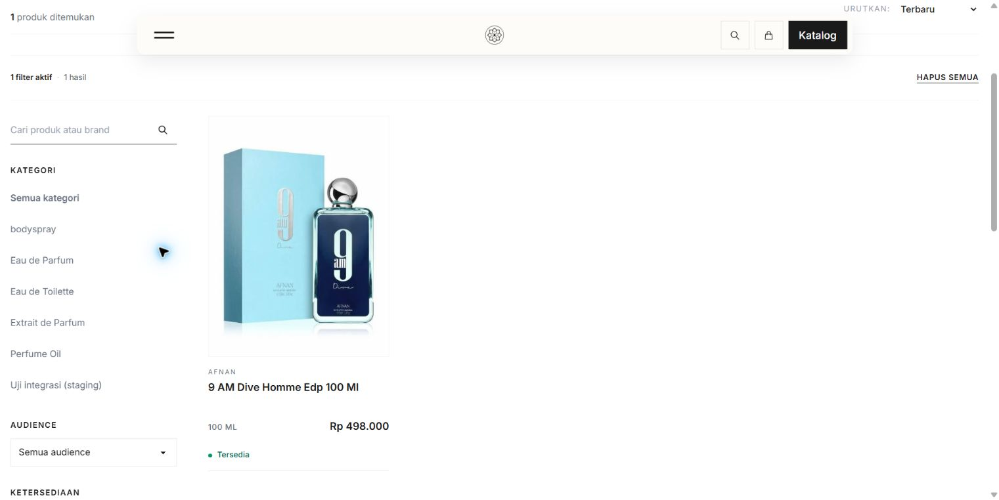
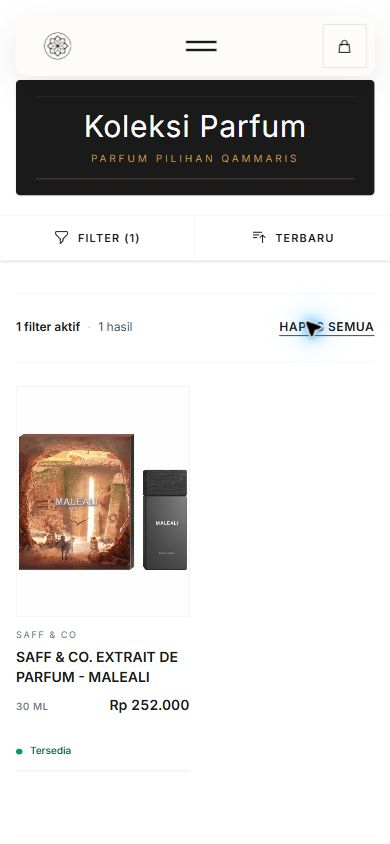

# P1-04 preflight evidence — 2026-10-06

Status: **IN_PROGRESS**. Fresh production target/catalog/Owner admin/live feed/worker/cron and GitHub release are now prepared; public activation remains pending. See [current target evidence](PRODUCTION_TARGET_PREPARATION.md) and [runbook](../../runbooks/PRODUCTION_CUTOVER_PREFLIGHT.md). Older dated captures below retain their original facts; Owner waived legacy matching/backup.

## Actual checks

- Remote staging guarded reads only: source/static/build hashes, schema/migration metadata, catalog counts/readiness, all launching media checksums/MIME/bytes, cron timestamps and authenticated feed response metadata. API key used only in memory; secret values never emitted or committed.
- 350 real launching products, each with a `qammaris_app` UUID and single offer. 95 retained drafts all lack photos/descriptions. Public staging includes one unchanged extra integration fixture; launching preview excludes it.
- All 1,016 launching photo files exist, with 350 primary images and total 35,974,303 bytes; JPEG MIME. No file copying, backup or cleanup.
- Source candidate `85ef088f4f9481c6f061141ee1d0a987ddf13832`: 218/220 application files match after line-ending normalization; other two are staging Basic Auth. 21/22 tracked static assets match, remaining difference same protection. Seven of eight build assets match local; staging CSS asset is absent locally, so release artifact coherence remains a gate.
- Existing CI [37421516661](https://github.com/husen211/Qammaris-Parfum-Website/actions/runs/37421516661) passed for that exact source candidate. This is inspected existing evidence, not a newly run local test suite or proof for later commits.
- Latest runtime read at 06:20:46 UTC: feed 401 without key / 200 with key; checkpoint 457 / `has_more=false`; no sync error, stock/image queues zero; minute scheduler/watchdog ages 43/44 seconds. Three historical failed jobs retained; no clearing or new test jobs.
- Public production catalog shows 208 products. [Baseline](production-public-baseline.json) records ten observed names/URLs. Actual production database/schema/accounts/media remain **Not confirmed**; no production SSH was used.

## Browser checks

Chrome desktop **1440×900**: public legacy production catalog/pagination, staging page 3 → search “9 AM Dive” through the search button after page load → one result, 100 ml / Rp498,000 / Tersedia.

Chrome mobile **390×844**: staging filter dialog → search “MALEALI” → submit “Tampilkan hasil” → one result, 30 ml / Rp252,000 / Tersedia. Captured application console errors: zero. Returned staging to full catalog (351 including fixture) and reset temporary viewport override.

The prior search-button observation did not reproduce after page load. Its previous cause is **Not confirmed**; no application fix is claimed. No UI redesign or code change.

## Impact and limitations

Only documentation/evidence and ignored local preview metadata were written. Application code, schema, catalog, media, accounts, env, permissions, production, source app and webhook destination unchanged. No package install, new broad suite/build, database backup, restore or cutover. Product/media preview metadata is not a backup or executable target import. Stage users/blog/store counts are zero; new-target Owner admin access must be prepared. Latest Owner decision waives legacy mapping/backup; the target release/transfer/runtime and reversible activation still need verification.

Documentation: active backlog status and production preflight runbook. Business rules/architecture/ADRs unchanged because this phase makes no new business or deployed-architecture decision. Recovery needs no database rollback for these read-only checks; documentation can be reverted independently. Next work remains minimal hosting baseline and exact fresh-target transfer/release preview inside P1-04, not another backlog phase.

Latest Owner override: legacy production data is dispensable; no legacy backup or merge. Earlier preservation/mapping/restore requirements in this checkpoint are superseded for the launch. Current plan uses350 public+95drafts in a separate fresh target, retains old files/database as-is for reversible routing, and still requires exact hosting/target/admin/runtime/cutover scope. No production mutation followed this approval; evidence files retain the facts captured before the revised plan.

## Production hosting and local release packet continuation

Owner authorizes the pending minimal production hosting read-only inspection with “lanjutt gas”. At13:37–13:38 Asia/Bangkok, SSH verifies production public root `public_html`, existing sibling `laravel_app`, and public storage link to `../laravel_app/storage/app/public`. CLI PHP8.2.33, required extensions, Composer PHP^8.2/Laravel^12 and locked Laravel12.39.0. Installed/web runtime and MySQL version Not confirmed; application was not bootstrapped and legacy database not queried. Actual app/database env fields report terisi; integration key/secret report tidak, values never printed/saved. Shell functions unavailable; filtered OS crontab returned zero explicit domain-path entries but hPanel task definitions/worker presence remain Not confirmed. No production writes or permission changes.

Frozen private packet in `storage/app/private/p1-04-preflight/20261006/release-85ef088/`:241 curated Git source/static files; complete staging build manifest+8assets;1016photos; fresh445-product preview excluding fixture; proposed public entry-point adapter and checksums. Source text verified accounting for line endings; complete build and every photo checked against server SHA256/size. Archives checked for safe paths and no symlink/env/vendor/private-review/session artifacts. Complete build capture resolves the earlier local CSS filename mismatch without rebuilding or changing CSS. Packet components total79,572,205bytes; copied from staging only, not a legacy backup.

Fresh13:40:46 catalog:350public+95draft,390offers,795identities (445qammaris_app),36referencedbrands/5categories. Zero published readiness blockers, relation orphans, duplicate UUIDs/slugs/offers; all95drafts lack photos/descriptions. All445IDs correspond to approved cohort and media path set equals verified1016photos. Only two view_count/updated_at pairs differ from preceding preview; business data unchanged. Source IDs require explicit target remapping; no account, sync state/checkpoint, queue/session or secret config in transfer packet.

Evidence: [hosting baseline](production-hosting-baseline.json), [packet manifest](release-packet-manifest.json), current runbook. Source candidate remains85ef088 with previously inspected passing CI; no new broad suite/build/package installation. No new UI change/browser recheck needed for this read-only continuation. Existing390x844/1440x900 proof remains attached. Production target/new database/admin/env, guarded transfer writer, cron/worker and public cutover are still not prepared/authorized/executed. The next work stays inside P1-04: concrete new-target preparation scope, then guarded transfer and activation review.
