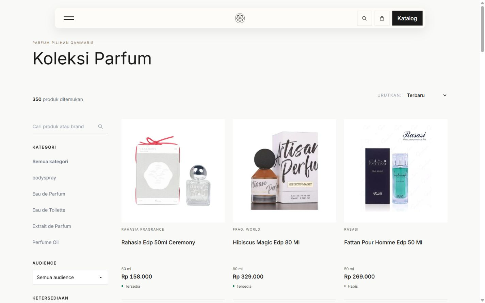
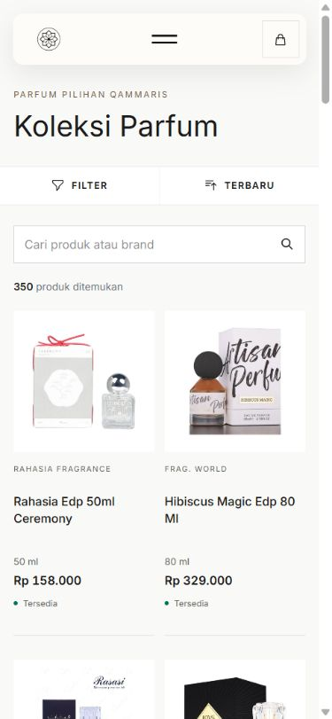

# P7-07 production release — 2026-10-06

Owner explicitly accepted the catalog UI and authorized pushing it to production. P7-07 is DONE; no next backlog item started.

- [PR3](https://github.com/husen211/Qammaris-Parfum-Website/pull/3) merged08:52:12UTC to main `2e1d962a78b9a74176fa37e636a3147fcd71f18b` from the already reviewed implementation3436aaf.
- [Main CI37439018661](https://github.com/husen211/Qammaris-Parfum-Website/actions/runs/37439018661): **261 Laravel tests,1708 assertions passed**, Vite build passed.
- [Production release37439081966](https://github.com/husen211/Qammaris-Parfum-Website/actions/runs/37439081966): build and deploy **success**; deploy08:53:44–08:59:54UTC. No File Manager or hPanel configuration changes. The longer installation duration is observed; its exact cause is **Not confirmed**.
- Packaged archive checksum OK; existing installer verifies release SHA, refuses pending migrations, caches config/routes/views, switches current, checks `/up`, then signals queue restart. No migration execution or data/media transfer from the UI fixture. No credential, permission-model, API or backend-app change.
- Actual production catalog remains350public products. No product price/availability/publication/identity/media mutation was performed by this task. Worker continues normal source synchronization; no claim is made that live business data is frozen during deployment.

## Actual live checks

[HTTP checks](production-http-checks.json): `/up`, `/products`, Hibiscus detail, new CSS/JS and sample stored JPEG all200. `.env`403 and vendor/autoload.php404; only status codes recorded, no sensitive response bodies.

New production JS is `app-Du6o-KoY.js`, CSS `app-nfQNixF3.css`. DOM shows catalog-specific cards, `object-fit: contain` and balanced display canvases for Ceremony/Hibiscus; original JPEG remains served from shared product storage. [Browser measurements](production-browser-checks.json): actual1440x900(3columns),390x844(2columns),320x844(2columns); zero horizontal overflow or clipped names, loaded square first-row media.

On actual mobile production, search `hibiscus` returns2 products (the existing search also considers descriptions); price_low retains the query. A native click in the Hibiscus photo opens the correct detail and its visible Kembali ke hasil link returns to that exact search/sort context. Hapus semua restores the catalog; Filter opens and Escape restores focus. No WhatsApp message, admin mutation or synthetic production record was created. No application-origin console errors observed; captured warnings came from an existing Chrome extension.

Physical iOS/Safari, remote media CORS failure, full production asset-by-asset review and new stock-event latency remain **Not confirmed**. Local pre-release image404 recovery and all six requested widths remain documented in README; no deliberate production failure was injected.

Rollback: the recurring installer retains prior code releases and shares existing env/database/media. Use the approved code-only rollback or revert/rebuild through GitHub if needed; do not restore/drop business data or roll back migrations for this frontend change. No rollback required after successful live checks.

Next recommended work: Owner-led photo/description completion for retained drafts through the existing admin workflow, separately scoped; not started here. P1-04 launch acceptance remains separate.

Additional: [mobile320](production-mobile-320.png), [detail navigation](production-detail-mobile.png).
