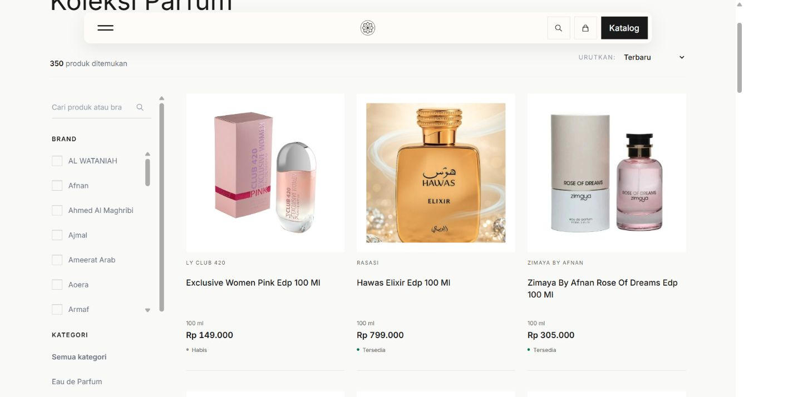

# P7-09 — Catalog pointer feedback regression

Status: IN_REVIEW, local patch verified; not deployed. Active surface: public product cards and the detail Kembali link. Owner supplied screenshots with local8001 page2 showing an intrusive gold panel and a retained black outline. No P8-09 work started.

## Diagnosis and change

`resources/css/app.css` globally paints active/pending anchors with gold background and an inset border, including full-height product cards. New scoped overrides remove that background/shadow only on `[data-catalog-product]` and `[data-catalog-return]`, using gold name/text feedback without changing geometry, photography or ordinary navigation. Other button/menu feedback stays unchanged.

`resources/js/ui/catalog-navigation.js` previously called `focus()` on the prior card after every return, including mouse returns. Actual Chrome pointer entry/Kembali produced focus-visible=true and a black solid outline. A stored keyboard flag now restores focus only for keyboard/assistive activation, including keyboard Kembali after pointer entry. Pointer Kembali overwrites earlier keyboard intent. Browser Back retains the departure intent. Scroll, sidebar/brand scroll, query/page matching and native links remain. Real keyboard focus-visible styling is preserved, not globally removed.

Changed code: the two files above and `tests/js/catalog-return-focus.test.mjs`. Documentation: BACKLOG current item and this evidence. Existing prior-release evidence was carried into the branch as a documentation-only commit; it is not a second release.

## Actual verification

- All15Node tests passed, including three new actual-module regressions for pointer return/history, keyboard/assistive focus, switching keyboard to pointer, legacy records and unrelated query/page contexts.
- Narrow Laravel catalog discovery/card-trust/hardening:13passed/100assertions. No PHP application code changed. Full PHP suite was not rerun locally for this patch.
- Final Vite build passed: `app-KGEUC8GU.css`, `app-IGlbRLj1.js`; whitespace check passed. Existing DaisyUI@property and large about-lanyard chunk warnings remain unrelated.
- Chrome CSS viewports1440x900/390x844 against the retained isolated350-published-product reference, normal pagination24/page. Before pointer return: card focused/focus-visible/solid outline. After pointer Kembali and browser Back: no forced focus/outline, transparent card background and no shadow; page2 and nonzero172px desktop position restored. Keyboard Enter entry/Kembali: prior card focused with solid focus-visible outline. Mobile pointer return has no forced focus/outline/background/shadow and no horizontal overflow. Desktop also has no horizontal overflow.
- Actual compiled stylesheet read in the browser confirms scoped active/pending overrides (`background-color:transparent; box-shadow:none`) and text-only gold feedback. A held/pending transient screenshot was not obtained; do not present a static screenshot as proof of that transient state. The visible before gold-panel evidence is the Owner's supplied screenshot.
- Final fresh local-page console-error observation returned[]; browser Tab/Enter and pointer links reach the correct Hawas detail. A rebuild briefly removed the local manifest while another local request was in flight; that request displayed a local manifest error. Completed build + reload restored it. No production request, deployment or configuration change involved. Artificial local detail latency caused CDP command timeouts; fresh page state was read and ordinary navigation verified afterward.

Screenshots are unedited browser captures. Default representative viewport captures are retained; extension raster dimensions can differ from CSS viewport and are not touch-device evidence.

| Evidence | File |
| --- | --- |
| Before mouse return | [desktop1440](before-return-1440.jpg), [mobile390](before-return-390.jpg) |
| After pointer return / browser Back | [desktop1440](after-return-1440.jpg), [mobile390](after-return-390.jpg) |
| Keyboard focus retained | [desktop1440](keyboard-return-1440.jpg) |
| Detail Kembali presentation | [desktop1440](after-detail-1440.jpg) |

## Impact, limitations and recovery

No schema/migration/package change, product content/price/availability/identity/media change, API operation or production/staging mutation. Only public GET view counters can change in the isolated UI fixture. No temporary account or business test record created. A temporary local-only read-only latency router/server was used for verification and removed/stopped afterward; the pre-existing8001 preview remains available.

Actual iPhone Safari/touch is **Not confirmed**. The earlier waiver applied only to PR4/PR5. This new patch is not deployed; future release must satisfy the repository's release approval/touch gate or receive an explicit Owner exception. No unrelated redesign or global removal of focus accessibility.

Rollback: revert these frontend changes and rebuild; no database/media restore or checkpoint adjustment. Recommended next action is review/release of this focused regression fix. P8-09 supplemental Shopee import stays next in the roadmap, not started here.

## Owner follow-up — brief click feedback and neutral waiting

Owner clarifies that clicked product names/Kembali should briefly change colour, then return to black while the destination loads, without retaining hover underline. This follow-up supersedes the earlier sustained gold pending-text description above. Stay within P7-09; no admin/media/data task started.

`catalog-link-feedback.js`, imported by the existing native click handler in `navbar.js`, gives immediate140ms gold text feedback, then black neutral text with no hover underline. A separate3px fixed gold status line indicates waiting without changing card geometry. `aria-busy` and a live status announce navigation; links remain usable. Pageshow clears transient/busy/loading state, and a10second recovery clears cancelled navigation. Pointer exit releases the clicked-state hover suppression. No preventDefault, navigation timeout, touchstart/pointerdown navigation, prefetch or cached price/stock HTML.

`catalog-navigation.js` also suppresses hover under the cursor on a pointer return. Browser Back can restore an existing keyboard-focused link independently of our code; the pointer-return path now blurs only that restored card if it is already active. Keyboard/assistive returns retain focus-visible and normal outline. Query/page/window/sidebar/brand context remains.

Changed files: `resources/css/app.css`, `resources/js/ui/catalog-link-feedback.js`, `resources/js/ui/navbar.js`, `resources/js/ui/catalog-navigation.js`, `resources/views/layouts/app.blade.php`, `tests/js/catalog-link-feedback.test.mjs`, `tests/js/catalog-return-focus.test.mjs`; this README and BACKLOG. No package/schema/API/content/media/runtime/environment change.

Actual verification:20Node regressions pass;13Laravel catalog tests/100assertions pass; finalVitebuild and whitespace pass. Final assets `app-Cs3BSI16.css`/`app-DB9IgdaC.js`. Existing DaisyUI@property/about-lanyard warnings unchanged. Five new regressions cover immediate feedback,140ms reset, pageshow/cancellation/retry, pointer exit, repeated clicks, ordinary/modified/download/external/same-page links and no navigation interception. Return tests additionally cover browser-restored focus.

Chrome1440x900 and390x844 on the350-product isolated reference: actual native clicks show gold immediately; subsequent browser observations show black text/no underline while `:hover` and pending/loading remain true. Public links/card geometry remain transparent/no shadow. A temporary GET-only local8003 router returning204 holds the old document for transient observation; this is a simulated cancelled navigation, not measured production latency. The10second cleanup was observed; new ordinary GETs resume after removing the test flag. Native mobile Kembali restored page2/y133.6 with no forced focus/loading; keyboard desktop returned y313.6 with visible focus. A mouse Browser Back following prior keyboard use now returns no focus/outline/loading. Searchhawas→8results and price_low sorting preserve the expected normalized URL.320px no horizontal overflow; fresh page console errors[]. Viewports are mouse-driven; actual touch/Safari still **Not confirmed**.

Three independent public GETs to the actual production Hawas detail:HTTP200 each, first-byte times358.860/143.685/140.197ms; total389.371/169.101/161.709ms. Same local8001 detail:HTTP200, first-byte496.602/162.117/152.119ms. These are client-observed HTTP timings, not server-only durations or browser click-to-paint timings. No code timer delays navigation. Normal full-document Blade GETs still incur request/render time on repeat entry; no server/cache performance gain is claimed by this feedback patch.

Follow-up screenshots: [before detail1440](before-feedback-detail-1440.jpg), [pressed card1440](after-pressed-card-1440.jpg), [waiting card1440](after-waiting-card-1440.jpg), [waiting Kembali1440](after-waiting-return-1440.jpg), [waiting card390](after-waiting-card-390.jpg), [pointer return390](after-feedback-return-390.jpg), [keyboard return1440](after-feedback-keyboard-1440.jpg), [pointer Browser Back1440](after-feedback-browser-back-1440.jpg). Existing earlier before-return390 screenshot remains the before mobile evidence. Raw screenshots are unedited; raster dimensions can differ from CSS viewport.

Recovery remains a frontend Git revert/rebuild. No database/media restore needed. Normal public detail GETs may increment the existing view counter, including the three production timing requests; no product content/price/stock/media write. Temporary test server/router/flag are stopped/removed after verification; pre-existing8001 preview remains. PR6 update/review is the next step; no production deployment, no new touch waiver and no P8-09 implementation performed.

