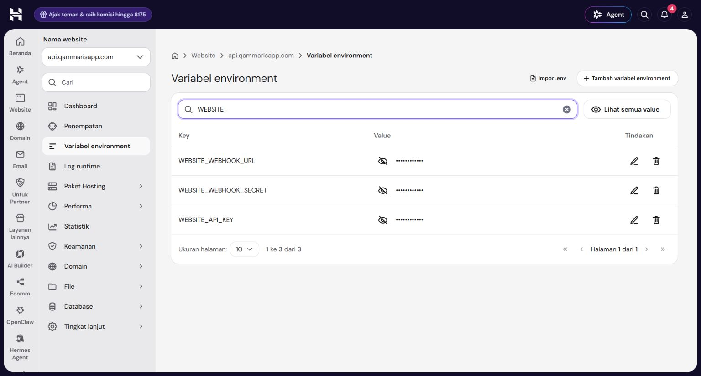
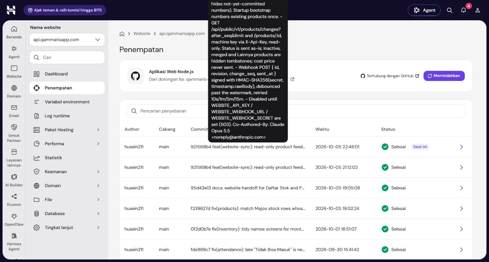
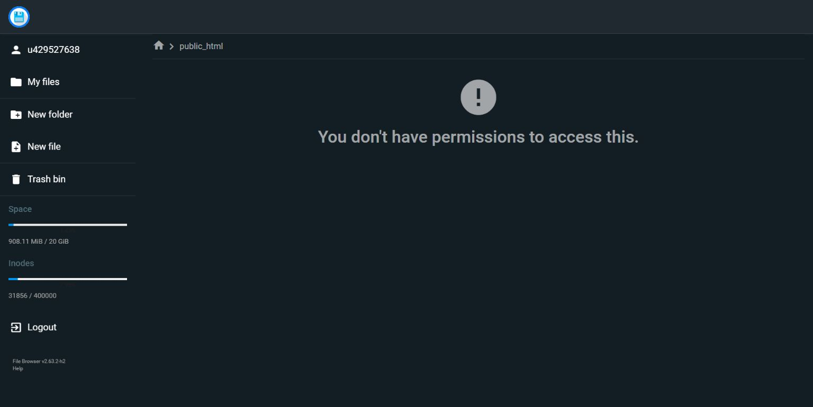
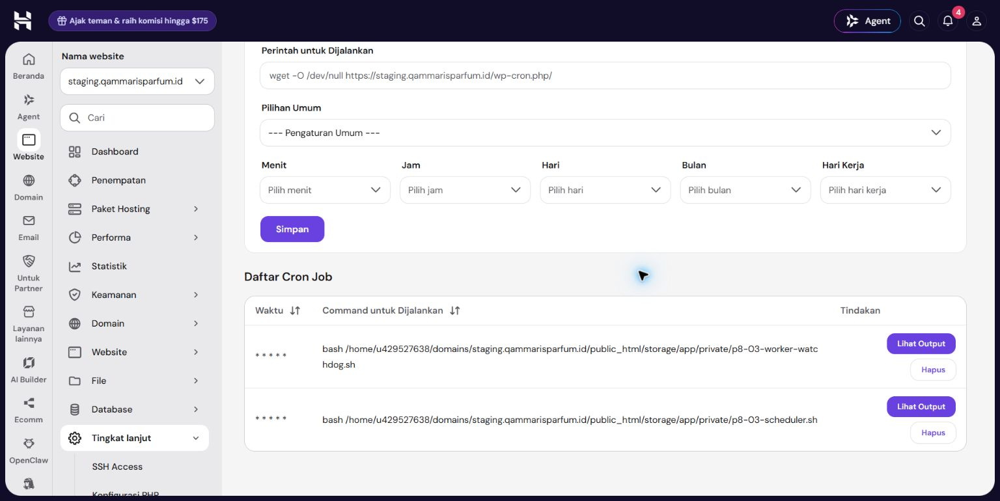

# P8-03 — staging activation evidence

Observed 2026-10-05. **Staging feed connected and initial sync complete; mapped-product end-to-end acceptance pending.** Owner authorized website staging SSH and the existing signed-in Chrome hPanel session for internal Node backend integration env/restart only. No website production cutover, app frontend change, app database access or filesystem permission change occurred in this continuation.

Latest Owner-selected follow-up: **AOERA MAJESTIC 50 ML** staging fixture **product 1** is prepared and published through existing readiness checks, explicitly mapped to UUID `00360de8-31bd-4982-bd73-ddaaba2d9658`. Baseline revision **59**, label **Tersedia**, global checkpoint **452**. Staging contains **one** test product; other catalog products have not been created/imported. Owner's sold-out test reached **Habis** automatically at revision/checkpoint **453** in about **10 seconds**, then the return-to-available reached **Tersedia** at revision/checkpoint **454** in about **13 seconds**, by stored timestamps. Server-side HTTP-context catalog/detail renders passed; queue is empty, price/size/URL/media retained. Owner subsequently logged into review Basic Auth; catalog/detail acceptance passed at 1440×900 and 390×844. Latest product revision/checkpoint is 456. Deployed rollback state scenarios and the inherited cron-lock repair passed; exact source ingress/browser-transition latency and remaining real-source scenarios are pending. [Latest runtime/browser/media follow-up](runtime-follow-up.md). [Exact pair, fixture fields and verification limits](aoera-staging-test.md).

## Release and isolation

- Staging: `https://staging.qammarisparfum.id`; receiver: `/integrations/qammaris-app/webhook`.
- Application SHA: `1867d83cb527f7573ce1046392860a83f64c8e65`. Previous: `7f712c48b1f4f39823345f6cba3998c93224d9b5`.
- [CI 37326362172](https://github.com/husen211/Qammaris-Parfum-Website/actions/runs/37326362172): success. [Staging release 37326698406](https://github.com/husen211/Qammaris-Parfum-Website/actions/runs/37326698406): success; R2 rehearsal disabled.
- PHP 8.2.33, APP_ENV staging, debug disabled, dedicated staging MySQL. Baseline products/variants/images/users: **0 each**. No reseeding, production snapshot replacement, product creation, price application or media write.
- Protected backup: `storage/app/private/p8-03-20261005-143646` on staging. Database dump, previous env, root .htaccess, source revision and assets retained. Directory 0700; sensitive files restricted. Compressed dump integrity checked; actual restore rehearsal **not performed**.
- Existing pending additive migrations plus `2026_10_05_000001_create_qammaris_app_integration` applied through release. Initial checkpoint was **0**; initial drain checkpoint was **452** (latest follow-up: **456**). No catalog product backfill.

## Secret and access boundary

Two distinct CSPRNG 32-byte hex values generated without printing. Local storage: Windows user-bound DPAPI outside Git, restricted to this user and SYSTEM. Initialization retries preserve the pair. Website API key: **terisi**; webhook secret: **terisi**; env and cached config **0600**. No values in repository, command arguments or report.

Latest continuation read the existing pair from staging env through authorized SSH and transferred it to browser session memory without output, clipboard or secret files. The existing pair was reused; **no rotation**. Only `WEBSITE_API_KEY`, `WEBSITE_WEBHOOK_SECRET` and the staging `WEBSITE_WEBHOOK_URL` were added through the backend hPanel environment editor. Applying these three changes restarted/redeployed the **same backend commit 921569b4**, completed at **2026-10-05 22:48:01 WIB / 15:48:01 UTC**. Other env values were not edited. Secret session variables were cleared after verification.

## Actual acceptance

| Check | Observed | Result |
| --- | --- | --- |
| Source feed without key | **401** | Passed after backend env/restart |
| Source with protected key, after_seq=0 and limit=200 | **200**, 200 ordered products | Passed |
| Initial drain/order/pagination | Pages **200 / 200 / 52**, next_seq **200 / 400 / 452**, has_more **true / true / false** | 452 unique products; client validates sequence, revision and whole-page contract |
| MySQL worker application | Snapshots **452**, checkpoint **452**, last_error **null**, last_synced_at **15:49:11 UTC** | Initial drain completed through the database worker; follow-up feed empty, has_more=false |
| Source product detail | Authorized GET for example UUID **200** | Passed |
| Staging root/catalog without Basic Auth | **401**, challenge present | Protected |
| Adjacent webhook-like URL unauthenticated POST | **401**, no Laravel payload | Protected |
| Exact unsigned POST webhook | **401**, invalid_signature | HMAC rejection, no CSRF 419 |
| Correct HMAC, invalid payload | **422**, invalid_payload | Raw-body signature verified |
| Correct HMAC, synthetic UUID/revision signal | **202**, accepted | Durable enqueue verified |
| Worker after accepted signals | Queue drained; checkpoint **452**, safe error cleared | Live source application passed; three historical failed jobs from pre-activation outage retained |
| Scheduler | Actual minute-cron invocation of qammaris-app:sync **16:00 UTC / 23:00 WIB** recorded DONE; worker last_synced_at **16:00:04 UTC**, checkpoint **452**, error **null**, queue pending **0** | Successful post-activation half-hour reconciliation passed; remaining feed empty, has_more=false |
| Owner sold-out change to mapped state | Source status time **16:51:56.923 UTC**, source revision **453**, website audit **16:52:07 UTC**, checkpoint **453**, label **Habis**; catalog/detail HTTP-context render **200** | Automatic state application passed, approximately **10 seconds** by stored timestamps; exact ingress/browser latency not captured |
| Owner return-to-available | Source status time **16:55:03.862 UTC**, revision/checkpoint **454**, website audit/cache **16:55:17 UTC**, label **Tersedia**; catalog/detail HTTP-context render **200**, queue empty | Automatic revert application passed, approximately **13 seconds** by stored timestamps; price/size/URL/media retained; exact ingress/browser latency not captured |
| Duplicate/old wake-up no-op | Signed revisions **59 / 59 / 1** each returned **202**; consumed by worker, source snapshot digest unchanged, checkpoint **452**, audit **0**, last_synced_at **15:51:14 UTC** | Live ingress/cache no-op passed; mapped-product mutation guard still needs its selected test |
| Hidden tombstones | **6** hidden source snapshots retained; website product count **0** | Cache retention passed; actual mapped public exclusion pending |

Initial-drain source status counts: **275 available / 163 sold_out / 14 unknown**, including hidden records. Public-safe example: **AOERA MAJESTIC 50 ML**, UUID `00360de8-31bd-4982-bd73-ddaaba2d9658`, available, revision **59**. This was initially an unmapped source example; Owner subsequently selected it for the single staging fixture above. At initial drain the staging catalog contained **0** products: synchronization does not create/publish products, copy prices or add media automatically.

## Hosting limits

### Latest follow-up: authorized staging SSH and backend hPanel, 2026-10-05

The File Manager blocker below was bypassed through **explicitly authorized staging SSH**, without recovering File Manager or changing file/folder permissions. Exactly the two existing minute cron entries were retained; no duplicates were added. Both protected heartbeat timestamps advanced across minutes, including **15:48:02**, **15:51:01/02** and **15:52:01/02 UTC**, ages under one minute at observation.

After verifying fresh heartbeats and matching the recorded scheduler child's working directory and command, only temporary PHP `schedule:work` PID **2412033** was terminated. Subsequent staging process inventory found **no schedule:work** and **one PHP integration worker** (PID **2058274**, with flock wrapper **2058264**). The original wrapper PID file was stale; the actual worker was verified by staging working directory and queue arguments. The worker consumed initial sync and duplicate/old signals; queue pending **0** at 15:51:24 UTC. Watchdog restart recovery was subsequently verified: at **15:56:28 UTC** the uniquely identified PHP worker was stopped and one reconciliation job persisted. At **15:57:02 UTC** the existing cron watchdog started a new PHP worker (**2380685**) and consumed that job; pending **0**, checkpoint **452**, last_error **null**. Recovery took about **34 seconds**. An OS reboot was **not tested**.

### Historical follow-up: hPanel-only authorization, 2026-10-05

Owner subsequently authorized completion through the **already signed-in hPanel browser session only**. Browser control now works; backend environment-variable UI at api.qammarisapp.com was reached with values remaining masked. No variable was added/edited, no backend restart occurred, and no new secret pair was created.

The domain-scoped staging File Manager opened, but entering public_html returned **"You don't have permissions to access this."** No permissions were changed, no account-wide File Manager or alternate administrative access was used, and the staging env could not be read. This is now a file-access blocker, not an absence of browser tools.

The previously empty staging cron list now contains exactly the two runbook commands, both **`* * * * *`**, entered through that staging site's hPanel. Screenshot below contains no environment values. Scheduler "Lihat Output" showed an empty output; this does **not** prove execution/heartbeat. Temporary schedule:work was **not stopped**, because no allowed process-control path was available. Cron execution, temporary scheduler shutdown and recovery remain pending; Owner assistance was requested. Existing revision guards/queue lock do not replace the requirement to stop duplicate scheduler invocation.

At this earlier follow-up a/b/d were unverified. The latest SSH/backend activation above supersedes its access/feed/checkpoint/process blockers. The selected product mapping and real Owner availability change are still pending. No regression suite rerun for panel/documentation-only changes.

Recovery: do not create duplicate cron entries. Owner must verify both protected script heartbeats and stop only the recorded temporary staging schedule:work process. If supervision cannot be verified, remove only these newly created staging cron entries and retain the original scripts/state. Source env must use the existing staging pair, never values in chat.

### Earlier SSH preparation (before hPanel-only restriction)

Root-only Basic Auth did not protect the effective public entry directory; the initial THE_REQUEST expression blocked signed delivery. Tested fix installs marked auth blocks at **both** rewrite levels with an exact webhook URI environment exception. Laravel exposes POST only, GET returns 405, every accepted POST requires HMAC. Catalog and adjacent paths remain protected. Final workflow installer executed twice with unchanged contents on retry. These are hosting observations, not general LiteSpeed compatibility claims.

Dedicated queue:work database (qammaris-app, sleep 1, timeout 60, tries 5) and schedule:work started using nohup/flock, observed alive across SSH sessions for over nine minutes. flock and PHP proc_open are available; **crontab binary absent**, no system cron installed. Temporary staging processes do not prove automatic crash/reboot recovery. Protected value-free watchdog/scheduler scripts and PID/lock files are retained for Owner hosting cron setup. Do not run cron scheduler and schedule:work indefinitely together.

## Validation and remaining gate

- Earlier activation local suite: **222 tests / 1487 assertions passed**; Pint passed integration/presentation PHP. SQLite/fake HTTP does not prove live source/MySQL integration.
- Deployed stateless receiver with throttle 120/min verified; no broad CSRF exemption.
- No application UI changes; hPanel evidence is desktop **1536 × 826**. [P8-02 browser evidence](../p8-02/README.md) remains local presentation proof, not live staging label proof.
- This continuation checked real HTTP auth/detail/pagination, MySQL worker drain, ingress no-op signals, minute cron/process state and safe hPanel save/restart. Application code/tests were unchanged; no new regression suite run.
- Complete P8-03 after review of one staging product/UUID mapping, Owner availability change/revert, latency measurement, mapped revision/hidden behavior. Owner was asked to select one safe product; no operational product was changed. No automatic next phase or production switch.

Rollback: retain backup/tables/checkpoint/audit/media. Stop only recorded integration processes if pausing. Restore protected env/auth/assets only within approved staging rollback, rebuild config and restore 0600. Prefer forward fix after source writes; no automatic table drop, cursor reset or production rollback.
