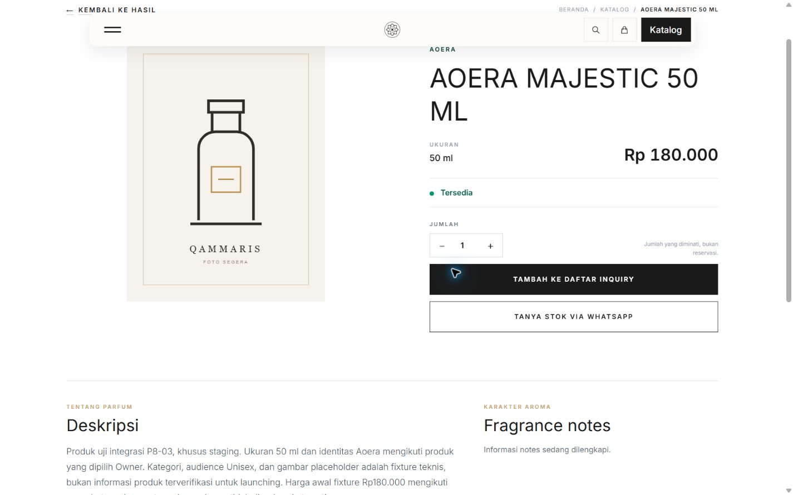
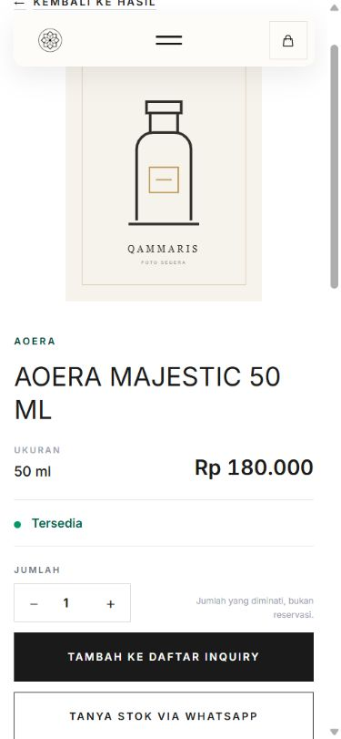
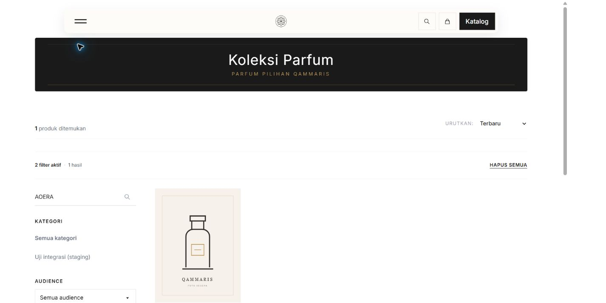
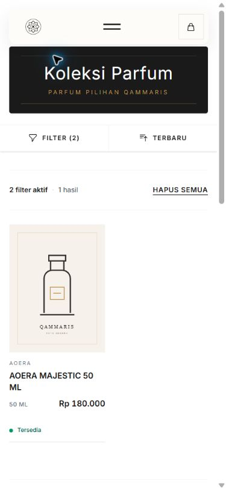

# P8-03 runtime follow-up — 2026-10-06 local

Observed **2026-10-05 17:04–17:13 UTC** (2026-10-06 after midnight in Asia/Bangkok). Scope remains P8-03 and the one Owner-selected AOERA staging fixture. Production cutover and broad catalog/media imports were not started.

## Current connection and mapped product

- Source without key: **401** at 17:04:38 UTC. Authorized client validated the current feed; explicit authorized HTTP check at **17:17:07 UTC** returned **200**, zero remaining rows, **next_seq 456**, **has_more false**.
- Staging retains **452** source snapshots and **one** catalog test product. Snapshot count is not launch-ready product count.
- AOERA product 1 is **available / Tersedia**, revision/checkpoint **456**, published/not hidden, with **five** persisted machine availability audits. In addition to the earlier 453/454 cycle, audits record revision **455** available → sold_out at **16:59:47 UTC** and **456** sold_out → available at **17:00:01 UTC**. Exact source timestamps/ingress timings for this later cycle were not measured.
- Three controlled website-side HMAC wakeups for the mapped UUID, revisions **456 / 456 / 1**, returned **202** at **17:12:30 UTC**. Worker drained them; at **17:13:16 UTC**, checkpoint/revision remained **456**, audit count **5**, queue **0**, last_error **null**. These are controlled receiver tests, not captures of the internal app's actual HTTP delivery.

## MySQL rollback scenarios

Verified the staging environment/database, exact fixture and seven participating tables' **InnoDB** engines. Within one outer transaction, locked checkpoint → source snapshot → product, used existing feed/application operations and process-local synthetic HTTP responses, then always rolled back. No source-app mutation or persistent test status was applied.

**27 checks passed:**

| Scenario | Result on deployed Laravel/MySQL |
| --- | --- |
| Equal/older mapped revisions with conflicting state | Product and audit unchanged |
| Sold out with ETA | **Habis · Restok segera**, still sold out; detail 200 and catalog visible |
| Unknown with no stock timestamp | **Tanyakan ketersediaan**, detail 200 and catalog visible |
| Inactive, merged, department `lainnya` | Each excluded from published catalog scope; detail 404; existing inquiry entry returns 409/empty items; publication/mapping retained |
| Available with a 2020 status timestamp | **Tersedia**, without expiry |
| Simulated source 503 | State, snapshot, checkpoint and audit retained |
| Malformed page after a valid first row | Whole page rejected without partial writes |
| Non-stock fields | Product identity/slug/publication/taxonomy and all offer/image/identity records preserved |
| Final rollback | Exact original product, snapshot, checkpoint, audit count and related records restored |

MySQL may consume auto-increment audit sequence values during rolled-back inserts; no synthetic audit row remains. Existing IDs are preserved. The first attempt stopped when repeatedly registered HTTP fakes returned the first response; its transaction rolled back. The corrected harness used one response callback and all checks passed. This was a verification harness issue, not a demonstrated application defect.

These are deployed MySQL/application-boundary proofs using **synthetic HTTP**, not real source-originated OTW/unknown/hidden deliveries or independent multi-process concurrency proof.

## Hostinger watchdog repair

At **17:04:38 UTC** the worker watchdog heartbeat was already **397 seconds** old while one worker remained healthy; scheduler heartbeat was fresh. Read-only `/proc` inspection proved both the flock wrapper and PHP worker inherited Hostinger's **`/tmp/cron_lock_*` on fd 3**. That prevented the next instance of the same cron from running while the worker lived.

Changed only the existing protected staging watchdog's child launch redirection to **`3>&-`**, closing that inherited descriptor before nohup/flock starts. Reviewable script: [staging-qammaris-worker-watchdog.sh](../../../tools/hostinger/staging-qammaris-worker-watchdog.sh). Retained the previous value-free script at `storage/app/private/p8-03-worker-watchdog-before-fd-fix-20261005.sh`. Original script mode **0700** retained; no chmod, env/credential/permission changes or cron entries added.

- PHP `exec()` is disabled; syntax checks were instead run directly with **bash -n**, exit **0**. An early attempt had already written the fix before encountering this runtime restriction; state was checked before continuing.
- At **17:10:23 UTC**, graceful SIGTERM sent only to worker **1959802**, after rechecking its staging cwd, PHP executable, exact argv and inherited lock.
- Existing cron started worker **2827848** by **17:11:31 UTC**. **No Hostinger cron lock inherited**, one PHP worker, no schedule:work, queue empty.
- Both cron heartbeats advanced from **17:11:02 UTC** to **17:13:01 UTC** while the same worker stayed alive. At **17:13:16 UTC** both ages were **15 seconds**. No duplicate cron or worker was created.
- Deployed script bytes match the repository copy; final bash syntax check passed and original file permission was unchanged. OS reboot remains untested.

Rollback should normally use a forward fix. Restoring the retained script would reintroduce the inherited cron lock; do not restore it casually. If an approved pause is needed, identify the exact staging process before stopping it; retain DB/checkpoint/audit/media.

## Authenticated browser acceptance

Owner logged into the existing staging review Basic Auth in Chrome, without sharing credentials or changing access protection. Tested the real staging catalog/detail at **1440×900** and **390×844**:

- AOERA name, **50 ml**, **Rp180.000**, **Tersedia** and inquiry actions visible.
- Placeholder image loaded from **website storage**; no horizontal overflow on either surface/viewport.
- Mobile filter dialog/search AOERA + available produced one result. Detail and “Kembali ke hasil” retained the search/availability query.
- Desktop sold_out filter produced a clear zero-result state, then available restored the result.
- WhatsApp href contains correct connected status and staging product link; no WhatsApp message sent.
- Captured console had **zero error entries** and **seven initialization deprecation warnings**. Origin of the warning is **not confirmed**; no unrelated UI/library change made.
- Browser viewport override reset; Owner's tab retained. No UI source changes, so these are acceptance screenshots, not a before/after redesign comparison. Live transition-to-browser latency was not measured.

## Current handoff — Owner steering 2026-10-06

P8-03 moved to IN_REVIEW; Owner explicitly deferred live OTW testing and authorized P8-04 feed-authoritative drafts/media. Remaining exact timing and rare-state/concurrency gates below are not claimed passed. P8-04 results are recorded separately in `../p8-04/README.md`; older photo/future-scope statements below describe this historical P8-03 follow-up only.

## Photos and launch scope

Current staging disk is **public**, not permanently switched to R2. AOERA uses the bundled technical placeholder, verified byte-for-byte against its stored copy. Integration preserves existing image records/files and never hotlinks or automatically copies source media.

`ProductMediaStorage`, image lifecycle operations and `ImportedProductImageDownloader` already support verified storage, reversible metadata archive, published last-image protection, HTTPS exact host allowlist, no redirects, byte/MIME/dimension limits and cleanup on failed attachment. Regressions below passed. Existing acquisition operates on **applied curated CSV rows whose products remain drafts**; it is not raw Shopee XLSX matching or permission to replace published product images. R2 copy/delivery rehearsals are historical P4 evidence; production R2 configuration is **not confirmed**.

Owner's Shopee export/matching counts are supplied context, **not reverified here**. Real-photo matching/import and final launch-set image completeness remain separate reviewed work. Retain existing media; preview by provider product ID plus reviewed name/size matches, manually resolve ambiguities, download/validate before attachment, maximum three active images, no hotlink/automatic overwrite. No real photo imported in this follow-up.

## Automated checks and remaining gates

- Integration + image/storage/lifecycle/transaction/admin-media selection: **50 passed / 272 assertions**.
- ConnectedAvailabilityPresentationTest: **5 passed / 50 assertions**.
- Total this follow-up: **55 passed / 322 assertions**, local isolated SQLite/fake storage/HTTP. Not a rerun of the full suite or proof of real Shopee downloads.
- Deployed rollback scenarios: **27 passed**, with final state restoration checks.
- bash syntax and actual cron/descriptor recovery: passed as recorded above.

P8-03 remains **IN_PROGRESS** under its existing runtime acceptance matrix: exact source webhook ingress/browser-transition timing, source-originated OTW/unknown/hidden behavior, deliberately missed source webhook recovery and independent multi-process MySQL concurrency are not confirmed by these simulations. Existing actual scheduled reconciliation, pagination and worker recovery proofs remain valid. No source disruption induced just to manufacture a test.

Next dependent work: **P8-04** reviewed launch identity/catalog set, including a real-photo exception report; **P1-04** production backup/restore preflight; then separately approved **P9-01** production cutover/observation. No next item started automatically. Board progress stays **7/10 phases = 70%**, not effort or production-readiness percentage.
