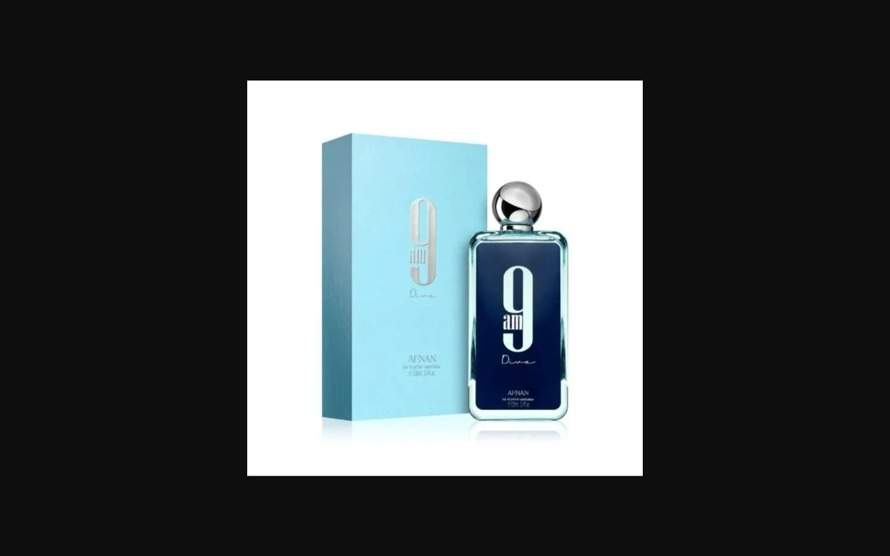
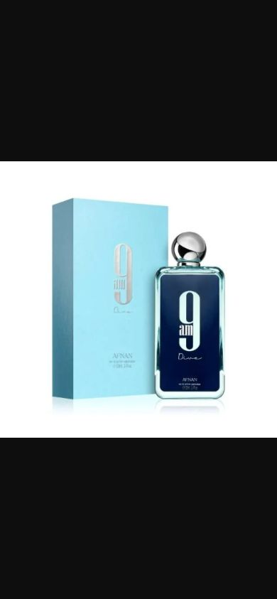

# P8-04 — Feed launch draft and media evidence

Owner approved 2026-10-06 local: source = current synchronized app feed; visible UUIDs create draft/nonactive records, source=app review, name-derived size/concentration only, Owner-owned Shopee cover plus first two additional downloads. Owner deferred the live OTW test. No production cutover or automatic publish.

## Release and safety

- Implementation commit/allowlisted PHP overlay: **bc470a7e32a2ea53ae259837c2fbc72b8c78e157**. [CI 37350390737](https://github.com/husen211/Qammaris-Parfum-Website/actions/runs/37350390737) passed Laravel tests and Node build. Draft PR #2 remains unmerged.
- Baseline server Git HEAD remains **1867d83cb527f7573ce1046392860a83f64c8e65**. Eight app PHP files installed from the exact Git archive, each SHA verified. This is explicitly a PHP-only overlay, not a full checkout/release. Full workflow was not used because it rewrites Basic Auth/permissions, which current Owner scope forbids.
- Protected pre-write backup `storage/app/private/p8-04-bc470a7/database-before.sql.gz`: 22 InnoDB tables, transaction-consistent dump, gzip content/hash verified, 37,642 bytes. Actual restore rehearsal **not performed**. Original two image-operation files, baseline and overlay manifests retained in this protected directory.
- Existing `.env`, cached config, root/public Basic Auth and frontend manifest hashes and modes stayed identical. No schema migration, package, credential, permission, source-app database/frontend, website-production or webhook-target change.

## Source, preview and apply

- Source cache: **452** snapshots, **446 visible / 6 hidden**. Live source without API key **401**, with protected configured key **200**, `after_seq=456`, `next_seq=456`, `has_more=false`; verified 17:46:20 UTC. No secret values emitted.
- Persisted staging batch **1**, contract `qammaris-drafts-v1`: **445 create / 7 skip** (six tombstones plus existing AOERA fixture). Preview produced no catalog/media writes. All source/payload/catalog hashes validated before one transactional apply.
- Apply created **445 nonactive drafts**, all UUID-linked. Total **446 website products / 446 qammaris_app identities**; the one previously published AOERA fixture retained its ID, slug, price, taxonomy, offer and placeholder metadata exactly. No new published product. Repeated exact apply returned the applied batch without new products/audits.
- Source availability matches all 446 connected products. Hidden source records have no website mapping. New price is source initial selling price; future source prices still do not update existing website offers. Majoo SKU stays matching assistance in cache, not offer identity; new offer SKU is null.
- **315 new offers**, plus existing fixture offer = 316. **36 brands**, **4 categories** (three explicitly parsed concentrations plus existing test category). Department never becomes category. Unknown size/concentration, audience, description and price remain review data; no invented values.
- **3 visible source=app** records became drafts with explicit review issue. Four new drafts lack valid initial price.

## Shopee media

- Read newest Owner export `mass_update_media_info_1853666049_20261005201835.xlsx`: **371 products**. Export has invalid worksheet-view metadata; stdlib ZIP/XML reader reads only actual cell table and validates headers without modifying workbook. Byte hash preserved. Extracted only provider ID/SKU/name/cover/first two additional URLs; no other fields.
- Conservative matching over visible feed: **180 strong / 83 manual-review / 183 unmatched**. Strong AOERA already exists and is skipped; **179 new drafts** receive Shopee identities/photos. Similarity never applies a match; source/Shopee SKUs are not equated. Ambiguous/missing sizes and explicit concentration conflicts need review.
- Queued **518** nonblank selected image slots. Several transient connection failures were retried once per affected row; successful files retained. First retry recovered Mykonos Black Opera cover; final retry queued nine other rows / 22 remaining slots.
- Final **518 stored / 0 failed / 0 blocked / 0 pending**, **179 real-photo draft products**. Total image records **519**, including the original AOERA placeholder. Downloaded media **19,896,811 bytes** on staging disk `public`; no Shopee hotlink.
- All 518 stored objects verified against outcome product ID/path, existence, SHA-256, byte size, detected MIME and dimensions. At most three images per new product. Cover remains primary and must succeed before additions; retry tests protect this order.
- Permanent production R2 delivery and production backup/restore remain **not confirmed**. AOERA remains a technical test fixture with placeholder, not a launch-approved product.

## Runtime and browser

Final 17:54:55 UTC: checkpoint **456**, last successful scheduled reconciliation **17:30:03 UTC**, sync error null, both stock/media queues **0**, one actual PHP stock worker, temporary media worker exited, **no schedule:work**. Minute heartbeats **17:54:01 UTC**. Three historical failed stock jobs from initial outage retained; no new failed media queue jobs. Process count excludes the flock supervisor.

Owner-authenticated Chrome loaded the website-hosted **Afnan 9 AM Dive** cover at **1440×900 / 390×844**, natural size 640×640. New draft public detail displays 404. Public catalogue still shows only the earlier AOERA fixture; no new draft leaks into listing. No UI layout/component changes; screenshots show media delivery, not approval of product facts or publish readiness.

## Catalog review and launch blockers

**0 of 445 new drafts are publish-ready under existing rules.** Exact blockers: missing concentration/category **196**, description **445**, audience/gender **445**, primary image **266**, single offer/size **130**. Blocker counts overlap; initial-price gaps are already among incomplete offers. Owner chooses/completes the launch subset; no automatic bypass of readiness rules.

Private review artifacts (not committed):

- `storage/app/private/p8-04-review/20261006/catalog-review.csv`: all 445 drafts, IDs/UUIDs/current state/photo counts/source=app and publish blockers.
- `.../staging-draft-preview.csv`: all 452 source decisions, matching candidates, price/size/concentration and review flags.
- `.../batch-audit.csv`: persisted outcomes; machine attribution comes from dedicated contract/Owner-authorized source label, with no fabricated human user.
- `.../legacy-mapping-review.csv`: read-only old 180-product reference, 182 rows (147 unmatched, 31 single candidate rows, four ambiguous candidate rows). Source SQLite hash unchanged; no old records restored/copied or identity mappings applied. These are suggestions, not current production facts.

## Tests and limitations

- Full local suite **234 passed / 1560 assertions** (isolated SQLite/fake HTTP/storage); after final queue dispatch change, focused draft/media suite **20 passed / 112 assertions**. CI for exact implementation SHA passed full tests/build.
- New draft preparation regression: **12 tests**, including source/catalog/payload stale guards, protected mapped product, current-catalog duplicate warning, repeat apply, hidden exclusion, source=app/incomplete fields, deterministic parsing, nonmatching size/concentration, shared-photo ambiguity, downloaded-cover ordering/retry and production/confirmation guard.
- Pint and `git diff --check` passed. Report checks: exactly 445 unique UUID drafts, 518 image count sum, maximum three per product, all three source=app records flagged, workbook hash preserved. Staging MySQL apply/repeat and real image checks passed; no independent multi-process draft contention test was claimed.
- No live OTW test this turn, per Owner; previous source ingress/browser timing/rare-state/missed-webhook/concurrency limitations remain in P8-03 evidence. No wholesale DB replacement or production identity transfer.
- Existing public filters expose all active taxonomy, so freshly created draft-only brands/concentrations can currently yield empty results. Record for P9 catalog acceptance; no unrelated UI refactor performed.

## Files, documentation and rollback

Changed implementation: PrepareQammarisAppDrafts action/command, ImportedProductName, ShopeeProductMediaReview, read-only QammarisAppMappingReview/command, XLSX extraction tool, two existing image operations and draft regression tests. Documentation: BACKLOG, BUSINESS_RULES, ARCHITECTURE, ADR-021 exception/ADR-022, launch draft/readiness runbooks and this evidence.

Retain drafts, identities, objects, batch audit and source checkpoint. Prefer forward fix. Before PHP rollback, confirm image queue is empty; protected originals can restore two prior operations while new command/operation use is disabled. No automatic deletion, migration rollback, database restore or production cleanup is authorized.

P8-04 **IN_REVIEW**. Recommended next item: Owner catalog/legacy-preservation review, then **P1-04 production backup/restore preflight** and separately approved **P9-01 hardening/cutover**. They have not started. Board remains 7/10 DONE phases = **70% phase-count only**, not launch-readiness percentage.
