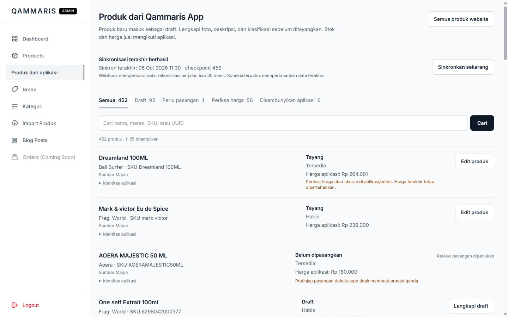

# P7-08 / P8-08 production release — 2026-10-06

**Released to production.** Owner explicitly approved release and selected “Lewati uji sentuh, rilis sekarang” after being told actual iPhone/Safari testing was unavailable. That gate is waived for this release only; touch behavior remains **Not confirmed**. No next backlog item started.

## Installed release and validation

- [Combined PR5](https://github.com/husen211/Qammaris-Parfum-Website/pull/5) merged11:33:12UTC to main `7b86b00d8d669b6b91e414cb9668090c8509baa9`. Ancestor PR4 was also marked merged by GitHub; no intermediate public-only main deployment.
- [Main CI37457167627](https://github.com/husen211/Qammaris-Parfum-Website/actions/runs/37457167627) passed PHP/Laravel and Node/Vite jobs. Pre-release actual checks:275 Laravel tests/1830 assertions,12Node regressions, scoped Pint, build and whitespace checks passed; detailed coverage in README.
- [Production release37457228753](https://github.com/husen211/Qammaris-Parfum-Website/actions/runs/37457228753) build and deploy succeeded. Deploy11:34:41–11:35:08UTC (18:35Asia/Bangkok completion). SSH confirms current symlink and release-revision.txt match the full main SHA.
- Existing installer verified archive, refused pending migrations, cached config/routes/views, switched code, checked health and signalled worker restart. GitHub handled code/assets; no File Manager, hPanel/env/credential/permission changes or internal-app deployment.

## Actual live checks

[HTTP evidence](production-http-checks.json): up/catalog/Hibiscus detail/new CSS/new JS/stored JPEG200; unauthenticated new admin inbox302; env403; vendor/autoload404. Actual built CSS `app-6oxhPUG5.css`, JS `app-C9yu8TPQ.js`.

[Read-only feed](production-feed-checks.json): configured,401 without key/200 with key,checkpoint459,next_seq459,has_morefalse,new_rows0,452cached snapshots/445UUID links. Only counts/status recorded, no keys or response bodies. An initial probe exited with a value-free verification failure; the retry succeeded. Exact first-failure cause is **Not confirmed**; no configuration or data was changed to retry.

[Runtime](production-runtime-checks.json):350published+95draft retained, one actual PHP qammaris-app worker after the normal restart/watchdog cycle, no schedule:work,queue0/failed0,last_error absent. Watchdog and scheduler heartbeat11:36:02UTC. Reconciliation remains everyThirtyMinutes in routes/console.php; a new post-release half-hour execution was not separately timed. Immediately after restart the worker count was0, then the minute watchdog restored1; no duplicate cron or manual worker created.

Authenticated Owner session opened `/admin/app-products`:452sources,95connected drafts,1unlinked source (AOERA staging test),6hidden tombstones,56price-review rows. Price-review includes invalid/missing source prices/offers or historical offer mismatch; **56 is not a count of API failures or necessarily56 missing prices**. Historical prices are not replayed/reset by deployment. Further price/candidate reconciliation requires a separately scoped preview/apply; no mass correction performed.

Browser checks on actual Chrome production:

- CSS viewport1440x900: inbox/catalog without horizontal overflow; first three catalog media loaded with contain. Desktop rail computed overflow-y:auto,client height526/scroll height1144. A native wheel attempt left rail/page offsets unchanged, so this session does not independently prove live wheel movement; local pre-release wheel evidence remains in P7-08.
-390x844: inbox/catalog without horizontal overflow; draft filter shows95. Opened connected One self draft editor: price276000 readonly, source availabilityHabis, missing-content/media readiness and stored-photo upload copy visible. No save/upload/publication.
-320x844: editor without horizontal overflow; Cancel returns to `/admin/app-products?page=1&status=draft`.
- Mobile catalog searchhibiscus gives2results, sorting price_low retains search; photo/card link opens correct detail. Next-photo button changes1/3 to2/3. Kembali returns exact `?search=hibiscus&sort=price_low`. Filter opens with Brand/Peruntukan/Tersedia/Habis; Escape closes and restores Filter focus. Nonzero live return-scroll restoration and actual swipe/touch were not exercised here; pre-release automated/local coverage is documented separately.

Raw browser captures below are JPEG bytes with correct `.jpg` extension, unedited. CSS viewport measurements above are authoritative; extension capture raster differs on some frames: inbox1440=1440x900,inbox390=390x843,catalog1440=1425x891,catalog390/detail390=375x811,editor320=320x844. Temporary viewport override reset afterward.

## Data impact, limits and recovery

No migration/schema/dependency change, production test account/record, historical checkpoint reset, mass price replay, publication or photo migration. Existing IDs/slugs/media/accounts preserved. Newly received visible UUIDs can now create drafts, and newer valid source revisions update selling prices/availability using existing audits. No new upstream product/price event was generated for this release, so event timing/new-draft creation in live production is **Not confirmed**; automated regression proof is not presented as a live event. Browser manual file upload remains unverified because local extension permissions blocked it; HTTP feature coverage passed. Raw Shopee XLSX enrichment remains future P8-09.

Recovery: existing retained prior code release or a reviewed GitHub revert/rebuild; preserve drafts, identities, audit rows, media and checkpoint. Do not delete new records or rewind the cursor. No rollback needed after live checks. Post-release evidence is committed on a separate documentation branch to avoid a second production deployment.

Documentation updated: BACKLOG status, ARCHITECTURE activation, this evidence; approved one-release waiver already recorded in BUSINESS_RULES and pre-release README. Next recommended scoped item: P8-09 supplemental Shopee XLSX preview/enrichment; not started.

Additional raw evidence: [inbox390](production-inbox-390.jpg), [editor320](production-editor-320.jpg), [catalog1440](production-catalog-1440.jpg), [catalog390](production-catalog-390.jpg), [detail photo2](production-detail-gallery-390.jpg).
