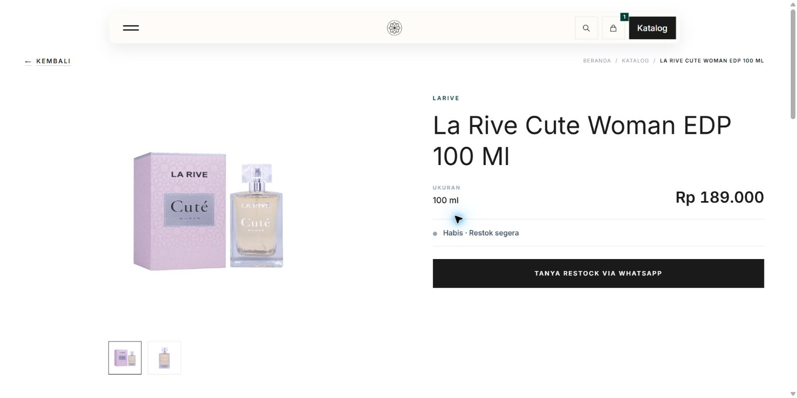
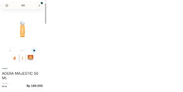

# Owner-approved Shopee supplement — production, 6 October 2026

## Outcome

Owner explicitly authorized completing and publishing the 21 rows missed by the earlier Shopee import. Batch **5**, `owner-shopee-v1`, applied successfully: **20 existing drafts enriched, one real AOERA MAJESTIC product created, all 21 published, 60 photos attached**. The catalogue now has **371 published products and 77 drafts**, previously 350/97. Existing published products were protected by a server-side comparison of all 350 product, offer, identity and media snapshots under the sync checkpoint lock; all were retained.

The remaining 77 drafts have neither description nor photos and are outside the supplied 371-row Shopee export. This is completion of this exact supplement, not permission to fabricate their content or publish them. Tester entries remain outside this wave.

## Sources and concrete decisions

Original Owner XLSX files were read without alteration. Media SHA256: `2710531916279ce70019bfa97220b6c55b870f819d939a4dceee3b909c57c70d`; basic-information SHA256: `dc2774e82193a1ae8cbc4ce9487f804343a68ba4513cccd4b5dc0af3141682bf`. Exact private 21-row approval manifest SHA256: `2d42fabcc24dc23400ec9f413934d92f8cccc76804f735a87b54b63bd885f67e`. The manifest contains no credentials and is retained only in private operational storage, not Git.

Each row uses its current app UUID and unchanged source revision/snapshot, not an old staging product ID. All prices use the current positive app selling price through `SyncSingleOffer`. Existing IDs, offers and slugs remain stable; publication does not change availability. Sold-out products are publicly discoverable.

Clear audience evidence is used where available; Unisex fallback is scoped to this exact Owner-approved wave. Three explicit hair/body mist products receive the active **Hair & Body Mist** category. This does not reinterpret app department as category or change future import defaults.

- **La Rive Cute Woman EDP 100 Ml:** source name Cube is a typo. Supplied package photo and [official La Rive Cuté page](https://www.larive-parfums.com/product/cute/) support the correction. The original URL `cube-woman-edp-100-ml` is retained. Source copy also incorrectly said Cote/Cote d'Azur and listed conflicting notes; a narrowly guarded follow-up corrects the description to a factual paraphrase of the manufacturer. Batch 5 row resolution records retain its before/after text and source URL; original approval and apply snapshots remain intact. Price, stock, photos and identities are unchanged.
- **Project 1945 Bamboe:** 100 ml, despite a conflicting 150 ml source title. Supplied basic description and bottle label on the additional photo say 100 ml; the [Project 1945 official Shopee listing](https://shopee.co.id/Project-1945-Bamboe-Roencing-Perfume-Extrait-De-Parfum-Unisex-100ml-i.525897828.14313059717) agrees.
- **Khadlaj Island Dream:** photos identify Island Dreams, distinct from the existing Island product. BSP The Ubud, Ameerat Arab Pink and Des Tentations Blue likewise retain their specific identities rather than borrowing another variant's media.
- **AOERA MAJESTIC:** one real production product is created from its app UUID. The excluded staging fixture is not imported or republished.

## Published supplement

| Source row | Product | ml | Photos |
| --- | --- | ---: | ---: |
| 16 | Project 1945 Vanilla Floresia Hair & Body Mist | 150 | 3 |
| 45 | Project 1945 Fields of Ubud Perfume | 100 | 3 |
| 49 | Emper Captcha 36 | 100 | 3 |
| 65 | Project 1945 Princess of Java Hair & Body Mist | 150 | 3 |
| 68 | Project 1945 Heiress of Minahasa Perfume | 100 | 3 |
| 87 | Project 1945 Arunika Citrus Hair & Body Mist | 150 | 3 |
| 100 | AOERA MAJESTIC 50 ML | 50 | 3 |
| 158 | Ameerat Arab Pink | 100 | 3 |
| 173 | Riffs Freeze Extrait De Parfum | 100 | 3 |
| 193 | Project 1945 Arumanis EXT Perfume | 100 | 3 |
| 244 | SAFF & CO. EXTRAIT DE PARFUM - SOTB | 35 | 3 |
| 298 | BSP The Ubud 1 100ML | 100 | 3 |
| 307 | FW Des Tentations Extrait de Parfum 100 Ml (Blue) | 100 | 3 |
| 323 | Shuhra Pour Homme | 90 | 3 |
| 344 | khadlaj island dream | 100 | 3 |
| 348 | Qammaris Signature Auth Extrait De Parfum 50ml | 50 | 1 |
| 352 | Project 1945 Velvet Toraja EXT Perfume | 100 | 3 |
| 360 | Project 1945 Symphony of Borobudur EDP | 100 | 3 |
| 361 | Project 1945 Bamboe Extrait Perfume | 100 | 3 |
| 370 | SAFF 8 CO EXTRAIT DE PARFUM - SOFR | 35 | 3 |
| 375 | La Rive Cute Woman EDP 100 Ml | 100 | 2 |

## Acquisition and safety

The fixed operator `tools/publish_owner_shopee_supplement.php` reuses existing draft creation, identity mapping, single-offer synchronization, media storage/attachment and publication operations. Persisted preview and source/target fingerprints prevent changed or occupied targets from being rebound. Database apply is transactional; acquisitions occur before locks/commit. No staging-only importer guard was weakened.

Hosting could not reach the Shopee CDN (IPv4 connection timeout). The same Laravel image downloader acquired the exact 60 allowlisted candidates locally, validating size, MIME, dimensions and SHA256. Verified bytes were transferred over existing SSH to new private staging space on the website server, then re-inspected and stored via the configured Laravel product disk. Each acquisition outcome records this provenance. No hotlinks, image editing, existing-image replacement, credential change or permission change to existing paths occurred. Private acquired originals and database before/after audits are retained.

No migration, application-code deployment, frontend build/release, app API change, feed replay, checkpoint rewrite, source-app edit or new package was involved. Pending UI PR6 remains separate.

## Checks actually run

- `OwnerShopeeSupplementTest` plus `QammarisAppCatalogWorkflowTest`: **22 tests / 143 assertions passed**. Coverage includes source-price enforcement, retained URL/sold-out state, real UUID creation, changed-source/occupied-ID/modified-copy refusal, invalid media rollback and transferred-image MIME/dimension validation.
- PHP syntax and scoped Pint checks passed. Git whitespace check passed.
- Full 371-row production reconciliation at **13:31:16 UTC**: **371 connected, 371 published and readiness-valid, zero unlinked/duplicate identities, 1,076/1,076 photo files present, zero hotlinks or source photo-count gaps**. All 350 historical UUIDs remain unchanged. Before the final Cute copy correction, 370 descriptions match cleaned source; Hawas is a pre-existing retained difference. Cute's subsequent manufacturer correction is an intentional second difference.
- Public HTTP: **60/60 photos returned 200 with image MIME**. A parallel detail-page probe returned 19/21 HTTP 200; two requests encountered a hosting MySQL connection error (`Operation not permitted`). Sequential recheck at **13:35:04 UTC returned 21/21 HTTP 200**, zero failures, and **21/21 current source-price matches**. This is a real intermittent hosting observation, not proof that hosting capacity is solved.
- Actual `apply` replay after completion returned **`replay_no_op=true`**, unchanged 371/77 counts, no duplicate product/media creation.
- Chrome desktop **1536×770**: Cute name, complete photo, 100 ml, app price, and **Habis · Restok segera** visibly present, no horizontal overflow. Mobile viewport **390×844**: real Majestic photo, 50 ml, app price and Tersedia present; gallery next button changed photo 1/3 to 2/3, images loaded, no horizontal overflow. These are mouse/viewport checks, not iPhone/touch verification. Public catalogue visibly reports **371 products**.

## Recovery and remaining work

Files added/updated for this task: `tools/publish_owner_shopee_supplement.php`, `tests/Feature/OwnerShopeeSupplementTest.php`, `docs/product/BUSINESS_RULES.md`, `docs/planning/BACKLOG.md`, the historical `docs/verification/p8-08/SHOPEE_COMPLETENESS_RECONCILIATION.md`, this report and its two screenshots. No application controller/model/view/configuration file changed. The operational helper/tests/docs remain local on the current checkout; no code push/merge/deploy was required or performed to publish these database-backed products.

No destructive replacement or legacy database restore is needed. If a specific row needs correction, use batch 5 identity and current fingerprint, then an Owner-approved forward correction or draft/archive operation. Do not rerun unrelated imports, delete media, or restore the whole catalogue. Original row audits plus the Cute resolution audit support a bounded recovery. The fixed applied manifest replays as a no-op.

Recommended next item: **P8-09 recurring Shopee upload/review workflow**, so later exports can supplement descriptions/photos through understandable admin controls. This supplement does not implement that interface or begin the next item. The 77 remaining drafts need new source content/manual photos separately. Hosting's intermittent connection refusal is recorded for focused diagnosis, not silently changed in this data task.
